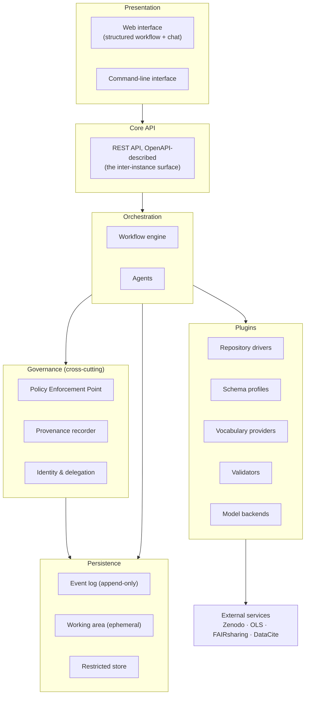
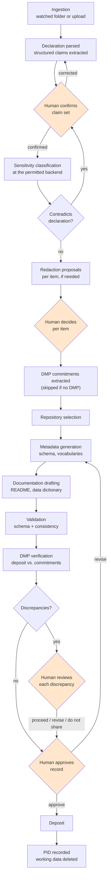
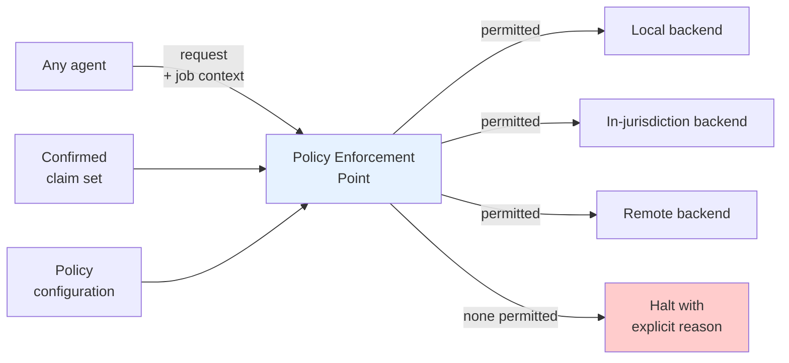

# Data Director: Implementation Architecture

**A conformant implementation of the RDA Data Director Agentic AI Blueprint v1.0**

Version 0.1 (draft for review) · Stage 2 deliverable

---

## 0. How to read this document

This document describes the architecture of a software system. It is written to be
read by someone who has not participated in its design and who may not be familiar
with the specification it implements. Every concept is defined at first use, and
every acronym is expanded. Section 2 is a glossary; readers already familiar with
research data management may skip it.

The document is deliberately **mid-level**. It names components, boundaries and
contracts. It does not name Python modules, classes or functions. That level of
detail belongs to a separate implementation specification, for two reasons: it
changes frequently during development, and it is better expressed as executable
code (type definitions, schemas, tests) than as prose. The rule applied throughout
is: *if a statement can be checked by a machine, it should be code and not prose.*

The test of whether something belongs here: if the system were reimplemented with a
completely different internal module layout, this document should still be true.

### Document status

| Item | Value |
|---|---|
| Status | Draft for review |
| Implements | RDA Data Director Agentic AI Blueprint, v1.0 Final, August 2026 |
| Blueprint licence | Creative Commons Attribution 4.0 International (CC BY 4.0) |
| Conformance claim | Self-declared, per Blueprint §10.2 |
| Companion documents | Implementation Specification (not yet written); Conformance Matrix (Appendix B); Architecture Decision Record log (Appendix A) |

---

## 1. Background

### 1.1 What problem this addresses

Researchers who wish to publish the data underlying their work face a set of tasks
that are laborious, poorly taught, and unevenly supported. They must choose a
repository that satisfies their funder, their institution and the journal
publishing their article; describe their dataset in a metadata standard
appropriate to their discipline; write documentation sufficient for a stranger to
reuse the data; obtain a persistent identifier so the dataset can be cited; and
confirm that nothing in the data breaches privacy, ethics or licensing
obligations.

Most researchers receive no training in any of this. Institutional support, where
it exists at all, is unevenly distributed. The predictable outcome is that
published research data is often described so poorly that it cannot be found or
reused, which defeats the purpose of publishing it.

### 1.2 What the Blueprint is

The **Research Data Alliance (RDA)** is an international, community-driven
organisation that develops standards and recommendations for research data
sharing. In 2026 an RDA Working Group published the *Data Director Agentic AI
Blueprint*, a community specification for a software tool that would assist
researchers with the tasks above.

The Blueprint is a **specification, not software**. It defines what such a tool
must do and how it must behave, without prescribing any particular technology,
model, or infrastructure. It contains:

- 12 **functional requirements** (numbered R1 to R12): the capabilities the tool
  must provide.
- 17 **non-functional requirements** (numbered C1 to C17): quality standards such
  as security, privacy and accessibility that apply across all capabilities.
- 14 **architecture principles** (numbered P1 to P14): design rules governing all
  architectural decisions.

Requirements carry priority levels using the keywords defined in **BCP 14** (Best
Current Practice 14, comprising Internet standards documents RFC 2119 and RFC
8174), a widely used convention in technical specifications:

- **MUST**: mandatory. No implementation may claim conformance without it.
- **SHOULD**: strongly recommended. Departure requires documented justification.
- **MAY**: optional but explicitly permitted.

Seven functional requirements are MUST: R2, R3, R4, R5, R6, R7 and R10. At the
time of writing, no implementation of the Blueprint exists. Conformance is
self-declared by the implementing organisation; no test suite and no independent
verification mechanism has been defined (Blueprint §10.2).

### 1.3 What this system is

This system is an implementation of that Blueprint. Its purpose is threefold:

1. To provide working software that assists researchers with data publication.
2. To demonstrate that the Blueprint is implementable, and to document precisely
   where it is not.
3. To produce reusable artefacts for other implementers: a candidate interoperable
   application programming interface, plugin contracts, and a conformance test
   suite.

It is not a repository. It does not store or preserve published data. It prepares
data and metadata for deposit into repositories operated by others, and then steps
back.

### 1.4 Relationship to the Blueprint's reference architecture

The Blueprint contains a reference architecture (its §9) describing five layers and
a set of components. This document is **informed by** that reference architecture
but does not replicate it. Where we depart, the departure is recorded as an
Architecture Decision Record (Appendix A) with its reasoning. The Blueprint
explicitly permits implementers to make their own design decisions provided the
principles are not contradicted.

The two substantive departures are: the provenance component is deterministic
software rather than an artificial-intelligence agent (ADR-009), and no vector
database is used (ADR-010).

---

## 2. Terminology

Terms are grouped by domain. Acronyms are expanded at first use throughout the
document as well.

### 2.1 Research data management

**FAIR principles.** Findable, Accessible, Interoperable, Reusable. A widely
adopted framework describing properties that published research data should have.
Note that FAIR does not mean "open": data can be FAIR and still access-restricted,
provided the conditions of access are clearly documented.

**CARE principles.** Collective Benefit, Authority to Control, Responsibility,
Ethics. A framework governing Indigenous data, asserting that Indigenous peoples
hold rights and interests in data concerning them. CARE cannot be assessed by
checklist; it requires engagement with the relevant communities.

**Metadata.** Structured information describing a dataset: its title, authors,
subject, methods, variable definitions, units, licence, access conditions and
provenance. Metadata is what makes data findable and reusable. In this system,
metadata is the primary product.

**Metadata standard (or schema).** An agreed structure specifying which metadata
fields exist, what they mean, and what values they may take. Different disciplines
and repositories use different standards.

**Controlled vocabulary.** An agreed list of permitted terms for a field, so that
different people describing the same thing use the same word.

**Ontology.** A structured framework of concepts and the relationships between
them, richer than a controlled vocabulary. Ontologies allow machines to reason
about meaning.

**Crosswalk.** A mapping between two metadata standards, specifying which field in
one corresponds to which field in the other. Crosswalks allow the same dataset to
be described in multiple standards without manual re-entry.

**Repository.** A service that stores, preserves and publishes datasets. Examples:
Zenodo, Dataverse, discipline-specific archives.

**PID (Persistent Identifier).** An identifier guaranteed to continue resolving to
a resource even if the resource moves. Examples follow.

**DOI (Digital Object Identifier).** The most common PID for datasets and
publications. Assigned by repositories through registration agencies such as
DataCite.

**ORCID (Open Researcher and Contributor ID).** A PID for individual researchers.
Also an identity provider: researchers can authenticate to third-party systems
using their ORCID account.

**ROR (Research Organization Registry).** A PID for research institutions.

**DMP (Data Management Plan).** A document, usually required by funders at grant
application, describing how a project will manage and share its data.

**Concept DOI and version DOI.** Some repositories assign two identifiers to a
dataset: a *version DOI* identifying one specific version, and a *concept DOI*
that always resolves to the latest version. This distinction is load-bearing in
our data model (§7.1).

**Data steward (or data support professional).** A specialist, often based in a
university library, who advises researchers on data management. A secondary user
of this system.

**CRediT (Contributor Roles Taxonomy).** A standard vocabulary of the roles people
play in producing a research output. Used here to record what a human contributed
to a metadata record.

**IRB / REC (Institutional Review Board / Research Ethics Committee).** Bodies that
review the ethics of research involving human participants. Their approval is a
precondition for publishing many datasets.

### 2.2 Provenance and audit

**Provenance.** A record of where something came from: what inputs produced it,
what process transformed it, who authorised the transformation, and when. In this
system provenance is a primary output, not a by-product.

**PROV-O (Provenance Ontology).** A World Wide Web Consortium (W3C) standard for
expressing provenance as a graph of three node types: *entities* (things),
*activities* (processes that act on things), and *agents* (parties responsible for
activities). We use PROV-O as our provenance format.

**Append-only log.** A record to which entries may be added but never modified or
removed. Corrections are made by appending a new entry that supersedes an earlier
one.

**Hash.** A short fixed-length value computed from a piece of data, such that any
change to the data produces a different value. Used to detect alteration. We use
SHA-256, a standard cryptographic hash function.

**Hash chain.** A sequence of records in which each record includes the hash of its
predecessor. Altering any record invalidates every hash after it, making
undetected tampering infeasible. This provides **tamper evidence**: the ability to
detect alteration.

**Tamper evidence vs. non-repudiation.** Tamper evidence proves a record has not
changed since it was written. Non-repudiation additionally proves *who* wrote it,
and requires cryptographic signatures and key management infrastructure. This
system implements tamper evidence only (ADR-007).

**Event sourcing.** A design pattern in which the authoritative record of a system
is an append-only sequence of events describing what happened, and the current
state is derived by replaying those events. Undoing an action is done by appending
a compensating event, not by deleting the original. This reconciles the
requirement for reversibility with the requirement for an immutable audit trail.

### 2.3 Artificial intelligence

**LLM (Large Language Model).** A statistical model trained on text, capable of
generating and interpreting natural language. Examples: Claude, GPT, Llama,
Mistral.

**Agent.** In this document, an agent is *a component that owns one step of a
workflow and has a defined contract*. An agent may or may not use a language model
internally. Some agents in this system are purely deterministic. This is a broader
definition than common usage, which often implies a language model with tools
attached; the broader definition is adopted deliberately, because it lets us treat
deterministic and model-driven components uniformly (ADR-009).

**Model backend.** A configured endpoint providing access to a language model.
Backends differ in where they run (on the local machine, on institutional
infrastructure, or on a remote commercial service), which determines what data may
be sent to them.

**Prompt injection.** An attack in which instructions are hidden inside content
that a language model processes, causing the model to follow the attacker's
instructions rather than the operator's. Because this system ingests documents of
unknown origin, prompt injection is a primary threat (§9).

**Hallucination.** A model generating plausible but false content. In a metadata
system this is a correctness problem with downstream consequences, because
incorrect metadata propagates into repositories and citations.

### 2.4 Software architecture

**API (Application Programming Interface).** A defined interface through which one
piece of software calls another.

**REST (Representational State Transfer).** A conventional style for web APIs using
standard HTTP methods.

**OpenAPI.** A standard, machine-readable format for describing a REST API. An
OpenAPI descriptor allows other developers, and other software, to discover what
an API offers without reading its source code.

**JSON (JavaScript Object Notation).** A plain-text data format, readable by both
humans and machines. Used here for all persisted state.

**JSON-LD (JSON for Linked Data).** JSON extended so that field names refer to
shared vocabularies, making the meaning of fields machine-interpretable. Used for
metadata records and provenance.

**Protocol (in the Python sense).** A declaration of the methods a component must
provide, without specifying how. Any component providing those methods can be used
interchangeably. Protocols are how this system defines plugin contracts.

**Plugin.** A component implementing one protocol, providing access to one external
system or one standard. Plugins are discovered at runtime and may be supplied by
third parties.

**Entry point.** A mechanism by which an installed Python package advertises the
components it provides, allowing the system to discover plugins without a central
registry.

**Policy Enforcement Point (PEP).** A single component through which all requests
of a certain kind must pass, and which applies policy to them. This system has one
PEP, governing access to model backends (§9.4).

**OAuth 2.0.** A standard by which a user authorises one system to act on their
behalf in another, without sharing their password. Used here for repository
deposit.

**OIDC (OpenID Connect).** An identity layer built on OAuth 2.0, used for
authentication.

**RBAC (Role-Based Access Control).** Granting permissions to roles rather than to
individuals, and assigning individuals to roles.

**ADR (Architecture Decision Record).** A short document recording one significant
design decision, its context, and its consequences. The ADR log is Appendix A.

**WCAG (Web Content Accessibility Guidelines).** An international standard for
making web interfaces usable by people with disabilities. Version 2.1 Level AA is
the baseline required by Blueprint requirement C6.

---

## 3. Scope

### 3.1 What this version implements

This version implements a **vertical slice**: a complete path from ingestion to
deposit, exercising every layer of the architecture, for a restricted range of
inputs and one repository.

The slice covers all seven MUST functional requirements (R2, R3, R4, R5, R6, R7,
R10), touches R1 (repository recommendation) minimally, and adds the
confidentiality machinery required by C2, P3 and Blueprint §5.2.

A vertical slice was chosen over a broad but shallow implementation because the
architecture's difficulty is concentrated in the interactions between layers, not
in the breadth of the feature set. A system that generates metadata for twelve
disciplines but has no working approval gate or provenance chain would demonstrate
less (ADR-002).

### 3.2 Inputs

Heterogeneous. Tabular data (comma-separated values, spreadsheets), documents
(text, Portable Document Format), and images. Content interpretation is performed
by a language model rather than by format-specific parsers, so extending to
further formats is largely a matter of extraction rather than of new logic.

### 3.3 Target repository

Zenodo, a general-purpose repository operated by CERN, accessed through its sandbox
environment for testing. One repository plugin is written. The purpose of the
plugin protocol is demonstrated by the interface, not by writing several
implementations of it.

### 3.4 Out of scope for this version

- Repositories other than Zenodo (the extension point exists; no other driver
  ships).
- Dataset discovery (R12).
- Precedent drawn from datasets deposited outside this system (§8.6). Precedent
  from our own event log ships; the external case requires a DataCite retrieval
  and a separate inference path, and is deferred.
- Autonomous CARE assessment. The system detects likely applicability of the CARE
  principles and refers the user to appropriate guidance. It does not assess
  compliance, which the Blueprint states cannot be done by checklist.
- Deployment-level availability guarantees (C7 uptime target, C9). See §12.

---

## 4. Design commitments

Six commitments shape everything that follows. Each derives from a Blueprint
requirement, but each is stated here as a property of *this* system.

**C-1. Nothing consequential happens without a human act.** Every irreversible
action, and every action that commits metadata to an external system, is preceded
by a structured approval bound to an identified person. Approval is never inferred
by a model (§8.2).

**C-2. Nothing is ever deleted.** All state is an append-only sequence of events.
Undo is expressed by appending a compensating event. This is what allows
reversibility (Blueprint C8) and immutable audit (P5) to coexist (§7.2).

**C-3. Confidential material is handled by reference.** The provenance record and
the workflow state contain identifiers, hashes and coded reasons. They do not
contain payload, secrets, or confidential free text, which live elsewhere under
access control (§7.3, §9.5).

**C-4. Authority derives from the channel, not from the content.** Documents
processed by the system are data. Nothing in a document can cause the system to
take an action, change a permission, or invoke a tool. Instructions are honoured
only when they arrive through an authenticated channel that identifies their author
(§8.6, §9.2).

**C-5. Every model call passes one policy gate.** No component holds model
credentials of its own. The permitted set of backends is a function of the
confirmed sensitivity classification (§9.4).

**C-6. Explanation is structured, not narrative.** Each agent emits a machine-
readable decision record: what it consulted, what it chose, why, and what it could
not determine. We do not surface model reasoning traces as explanations (ADR-006).

### 4.1 The human as root of trust

Every control described in this document terminates in the same place. The
sensitivity classification is authoritative because a person confirmed it. A
redaction is applied because a person approved it, item by item. A metadata record
is deposited because a person authorised it. A Data Management Plan commitment can
tighten a constraint automatically but can only be relaxed by a person. Four nodal
points, and each is the point at which the system stops deciding and a human
starts.

This is what Blueprint principle P4 requires, and it is the correct design. It also
raises the obvious question: *who controls the controller?*

The system cannot answer it, and should not pretend to. A root of trust is by
definition not verifiable from inside the system it roots. Our software has no way
to determine whether the person confirming a declaration is honest, whether they
are competent to judge what they are confirming, or whether they read it at all.
Any mechanism we built to check them would itself need checking, and the regress
does not terminate in software.

What the architecture does instead is shift the guarantee. **We do not attempt to
make human decisions correct. We make them attributable, tamper-evident, and
reviewable.** Every consequential act is bound to an authenticated ORCID, recorded
as a structured event, hash-chained so it cannot be altered afterwards, and
readable by an auditor role that can change nothing. The system defends the
integrity of the record of the decision, not the quality of the decision. The
regress terminates outside the software, in institutional governance: the ethics
committee, the research office, the audit function. Blueprint §5.1 assumes exactly
this, requiring that accountable human roles be documented before the tool is
configured. Our contribution is to make the record legible to the bodies that hold
those roles.

Three failure modes follow from this position, and each is stated rather than
mitigated away.

**The dishonest declarant.** If a researcher asserts falsely that material is
non-sensitive, the system will process it accordingly. This is by design and cannot
be otherwise: the assertion is the input on which everything downstream depends.
What the architecture provides is that the assertion is attributable to a named
person at a recorded time, which is the same accountability structure that governs
an ethics statement submitted to a journal.

**Rubber-stamping.** The more realistic risk is not dishonesty but automation
complacency: a reviewer who approves everything because approving is easier than
reading. Two responses. First, the interface is shaped so that a considered
decision is cheaper than a blanket one: decisions are per item, there is no bulk
accept, evidence is surfaced beside each proposal, and model uncertainty is
displayed rather than hidden. Second, and more usefully, rubber-stamping is
*measurable* from the event log. Approval latency and per-item override rates are
recorded, so an institution can detect the pattern empirically rather than assume
its absence. We do not build that analysis, but we ensure the data exists
(§13).

**Role concentration.** Where one person holds every role, the separations in §10
provide nothing. This is why administrator authority is separated from workflow
authority at the architectural level rather than by policy, and why data steward
overrides are themselves recorded as distinct events. In a single-user local
deployment the separation genuinely collapses, and that is a property of the
deployment profile that an institution should understand before choosing it.

The honest summary: this system makes a human answerable for every consequential
action. It does not, and cannot, make that human right.

---

## 5. System overview

### 5.1 Layers



Reading the diagram: user interfaces call the core API; the core API drives the
workflow engine, which sequences agents; agents reach the outside world only
through plugins; and everything passes through the governance components, which
are cross-cutting rather than a layer in the stack.

### 5.2 Why the governance components are drawn to the side

The Blueprint treats provenance (R10) as applying to every action in every phase,
and treats security (P3) as a property built into every component. Components with
that character cannot sit in a layer, because a layer can be bypassed. The
provenance recorder and the Policy Enforcement Point are therefore positioned as
mandatory intermediaries: an agent cannot call a model except through the PEP, and
cannot change workflow state except through the recorder. Enforcement is
structural, not a convention that developers are asked to observe.

### 5.3 The core API and the internal contracts

Two contract surfaces exist, and conflating them would be an error.

The **core API** is the external surface: a REST API described by an OpenAPI
descriptor. It is versioned and stable. This is the candidate answer to Blueprint
requirement C5, which states that all Data Director instances must expose a
harmonised API to enable interaction between instances, but which does not
specify that API. Because no such specification exists, ours is offered as a
starting point for community discussion rather than as an authoritative reading.

The **internal contracts** are the plugin protocols. They are Python interfaces,
not web services. Requiring every plugin to be a network service would make a
single-user installation on a laptop impossible, contradicting principles P11
(deploy anywhere) and P14 (low environmental impact).

The OpenAPI descriptor is **generated** from the same type definitions the runtime
validates against, so the published specification cannot drift from the running
software (ADR-003).

---

## 6. Agents and plugins

The system has two extension mechanisms with different purposes. Keeping them
distinct is what prevents each agent from growing its own ad-hoc extension
system.

### 6.1 Agents

An agent owns one step of the workflow. Agents are few, fixed, and correspond
roughly to the phases of the Blueprint's process flow. An agent reads workflow
state, performs its step, emits a decision record, and writes new state. It does
not call another agent directly.

| Agent | Responsibility | Uses a model? | Blueprint requirements |
|---|---|---|---|
| **Ingestion** | Detects new material, registers it, computes hashes, extracts structural profile | No | (input to all) |
| **Declaration** | Parses the responsibility statement, extracts structured claims for human confirmation | Yes | C2, §5.2 |
| **Classification** | Assesses sensitivity of the material, proposes redactions | Yes | C2, P3 |
| **DMP** | Extracts commitments from a Data Management Plan; verifies the prepared deposit against them | Sometimes | R8 |
| **Repository** | Recommends and confirms a target repository | Yes | R1 |
| **Metadata** | Generates the metadata record; selects schema and vocabularies | Yes | R2, R3, R6 |
| **Documentation** | Drafts README file and data dictionary | Yes | R5 |
| **Validation** | Checks the record against schema and consistency rules | No | R4, C15 |
| **Publication** | Executes deposit through a repository driver | No | R7 |
| **Provenance** | Records every action as PROV-O; maintains the hash chain | No | R10, P5 |

Four of ten agents use no model at all, and one (DMP) uses one only for some of its
plugins. This is why the definition of "agent" in
§2.3 is deliberately broad: the uniform treatment is what allows the provenance
recorder to be an agent in the architectural sense while being entirely
deterministic in operation, which is essential because non-deterministic audit
evidence is not audit evidence.

### 6.2 Plugins

A plugin implements one protocol, for one external system or one standard.
Protocols are shared across agents, which is what keeps the extension mechanism
singular.

| Protocol | Purpose | Implementations in this version |
|---|---|---|
| `RepositoryDriver` | Deposit to one repository: authentication, pre-flight checks, upload, PID retrieval | Zenodo |
| `SchemaProfile` | Emit and validate one metadata standard | DataCite; RO-Crate |
| `VocabularyProvider` | Search one terminology service | Ontology Lookup Service (OLS) |
| `ValidatorDriver` | Check a record against one validation technology | JSON Schema; SHACL |
| `ModelBackend` | Provide access to one language model endpoint | Local (Ollama); remote API |
| `RegistryDriver` | Query one registry of repositories or standards | FAIRsharing; re3data |
| `DMPSource` | Read commitments from one Data Management Plan source | Document (link to text or PDF, model-extracted); maDMP (machine-actionable, deterministic); fixture (mock plans, for testing) |
| `IdentityProvider` | Authenticate a human | ORCID |
| `ContainerFormat` | Detect and safely unpack one archive format | zip; tar; BagIt; RO-Crate |

Plugins are discovered through Python entry points. A third party installs a
package; the system finds it. There is no central registry to maintain, which
matters for principle P9 (local adaptability) and P7 (open source).

### 6.3 The capability manifest

Every plugin declares a manifest: which Blueprint requirements it contributes to,
which schemas it emits, whether it can operate without network access, and its
data residency characteristics (where any data it transmits will be processed).

Two consequences. First, part of the conformance matrix (Appendix B) can be
generated from what is actually installed, turning a claim about our source
repository into a claim about a specific deployment. Second, at startup the system
can report which requirements the current configuration is capable of satisfying:
a deployment with no `DMPSource` plugin says so explicitly, rather than silently
omitting requirement R8.

### 6.4 Plugin trust

Plugins are third-party code running inside a system that handles confidential
material. Three constraints apply.

A plugin never holds model credentials and never calls a model backend directly;
it must route through the Policy Enforcement Point. A plugin never receives
repository credentials as values; it requests them by scope from the credential
broker, which injects them at call time. A plugin declares its network
requirements in its manifest, and a deployment may refuse to load a plugin whose
declared residency is incompatible with local policy.

---

## 7. State, provenance and the data model

### 7.1 Datasets and versions

The model distinguishes two things that are commonly conflated.

A **Dataset** is the concept: "the temperature series from station 14". A
**DatasetVersion** is one concrete state of it. Metadata records, provenance chains
and deposits attach to versions, never to the concept.

This mirrors how repositories behave. Zenodo assigns a *version DOI* to each
deposited version and a *concept DOI* that resolves to the latest. Modelling this
from the start means that corrections and extensions to already-published data are
first-class rather than an awkward special case, that the relationship fields
required by the DataCite standard (`isVersionOf`, `isNewVersionOf`,
`isPreviousVersionOf`) are derived from structure rather than entered by hand, and
that requirement R9 (retrofitting metadata onto already-published datasets)
operates naturally by producing a new version.

### 7.2 Workflow state as an event log

A **Job** is one execution of the workflow for one dataset version. Its state is an
append-only sequence of JSON files:

```
state/
  job-01JBQ7X.../
    00001-1757001234.json    workflow.created
    00002-1757001402.json    material.registered
    00003-1757001455.json    declaration.parsed
    00004-1757001501.json    declaration.confirmed      (human, ORCID)
    00005-1757002011.json    classification.completed
    00006-1757002340.json    redaction.proposed
    00007-1757002901.json    redaction.decided          (human, ORCID)
    ...
```

Each file contains the event, the resulting state snapshot, and the SHA-256 hash of
its predecessor.

The sequence number precedes the timestamp because timestamps collide and do not
sort reliably across clock adjustments. Files are written under a temporary name
and moved atomically, so a crash during writing cannot leave a corrupt record.

This yields four properties from one mechanism:

- **Resumability.** A job interrupted on Monday is resumed on Thursday, possibly by
  a different person with the appropriate role, by replaying its events.
- **Rollback** (Blueprint C8). Reverting is appending a compensating event naming
  the state restored. Nothing is deleted.
- **Tamper evidence** (P5, C1). The hash chain makes undetected alteration
  infeasible.
- **Traceability** (R10). The event log and the provenance graph are two
  projections of the same sequence, so they cannot disagree.

The format is plain JSON validated against declared schemas, not a serialised
in-memory object graph. Serialised object graphs execute arbitrary code when
loaded, cannot be inspected or diffed, break when the code is refactored, and
capture whatever happens to be reachable including credentials and payload. Every
one of those is disqualifying here (ADR-015).

### 7.3 The three classes of material

The Blueprint states that the tool does not retain data, while also specifying
persistent storage. The apparent contradiction resolves into three classes with
different lifecycles.

| Class | Content | Lifecycle | Sovereignty |
|---|---|---|---|
| **1. Data** | The payload the researcher intends to publish | Ephemeral working area; deleted after successful deposit, replaced by the PID | Full constraints |
| **2. Metadata and workflow artefacts** | Records, decision records, validation reports, provenance | Retained | Constrained if confidential |
| **3. Derived artefacts** | Structural profiles, extracts, samples, anything transmitted to a model | Not retained; only a description and hash are kept | Full constraints |

#### The exposure ledger

Class-3 artefacts are recorded in an append-only **exposure ledger**: one entry
per release of payload to a model, holding the artefact reference, what kind of
release it was, the byte count, the digest of what was sent, the classification
in force, the backend and its residency, and a label naming the field or chunk
responsible. The released content itself is never stored, so the ledger can
prove what was exposed without holding the exposed material.

Two properties follow that the class-3 lifecycle alone does not give.

**A budget, per job and per artefact.** Bounding the probe vocabulary (cluster 3
Part C) bounds what *kind* of read is possible; it does not bound how much. A
model steered by injected content should be able to exhaust its allowance rather
than exfiltrate without limit. The two scopes fail differently: a per-artefact
limit stops one file being read entirely through repeated sampling, and a
per-job limit stops the same trick spread across many files. Exhaustion halts
the workflow with a recorded reason rather than truncating silently, because a
model that stops receiving data without being told will conclude the data is
absent, which is a worse failure than stopping.

**A categorical distinction for whole-artefact releases that leave the
premises.** A field sample or a document chunk is incremental and proceeds under
the budget. A full document or a media file exposes an entire artefact, and
there is no smaller version of that decision, so where it goes to infrastructure
beyond the institution it requires an identified human authorisation recorded
against the entry.

Where such a release goes to an on-premise model it does not. An earlier version
of this rule required authorisation for every whole-artefact release including
local ones, which made it impossible to look at an image in order to find out
whether it was sensitive without someone first authorising the exposure — the
same circularity the declaration gate exists to break, and one that would have
made media inspection unreachable in precisely the deployments most needing it.
Where material never leaves the premises, policy has already decided by
permitting the backend at this classification.
Derived descriptions carrying no payload — structural profiles, aggregate counts
— are recorded for completeness but not charged, since charging for them would
make the budget a limit on analysis rather than on disclosure.

Class 3 is the class the Blueprint's reference architecture does not name, and it
is where the compliance surface actually lies. Principle P10 extends sovereignty
obligations to prompts, logs, temporary files, backups and embeddings. By
retaining only a description and hash of each derived artefact, the system can
prove *what was exposed to what* without holding the exposed material (ADR-005).

### 7.4 Provenance

Provenance is recorded as PROV-O, expressed in JSON-LD. Three node types: entities
(datasets, records, documents), activities (agent actions), agents (both software
agents and humans).

Every activity records: its type, timestamp, the software agent identity and
version, the human on whose behalf it ran (by ORCID), input entity references,
output entity references. The Blueprint (§5.4) requires that agents never act
anonymously; the recorder rejects any activity lacking a human principal rather
than writing a null value.

Entities are referenced by identifier and hash. **The provenance graph never
contains payload.**

### 7.5 Provenance under confidentiality

A recurring difficulty: a complete provenance record can itself disclose what it
was meant to protect. Recording "the informant's name was removed from column 3
because she is the only midwife in the district" defeats the purpose of the
removal.

Three mechanisms resolve this without gaps in the record.

**Reasons are coded, not free text.** A redaction activity carries a `reasonCode`
from a controlled vocabulary: `personal-data`, `third-party-rights`, `embargo`,
`indigenous-governance`, `commercial`. The open record therefore reads: *at time T,
agent X, authorised by human Y (ORCID), removed three fields from entity E1
producing E2, reason `personal-data`, justification digest `sha256:...`*. The shape
of what happened is fully disclosed; the content is not.

**Free-text justification lives in a restricted store**, keyed by activity
identifier, with only its hash in the chain. An auditor with the appropriate role
dereferences it. Everyone else holds a stub that still proves the justification
existed and has not changed since.

**The graph is partitioned by visibility.** Named subgraphs, restricted by default
per P3 and P5. Export at a given clearance emits the subgraphs at or below it, and
the result remains internally consistent, because the restricted portions were
only ever hashes to begin with (ADR-014).

---

## 8. The workflow

### 8.1 Sequence



Shaded nodes are human decision points. Every one of them is a structured act bound
to an authenticated ORCID.

Repository selection precedes metadata generation, following the Blueprint's
explicit instruction (§8.2): the chosen repository determines the required schema,
vocabularies and validation rules, so generating metadata first would mean
generating it against the wrong target.

### 8.2 Human interaction: two channels

Approval gates support natural-language interaction, because requiring users to
express corrections through form fields would make the review step more laborious
than doing the work manually. But there is a hard line between conversation and
commitment.

**The revision loop is free text and fully model-mediated.** *"No, the temporal
coverage is wrong, it's 2019 to 2023 not 2019 to 2021, and drop the third
keyword."* The agent interprets, revises, and produces a new proposal.
Misinterpretation here is cheap: nothing has been committed, and the result still
faces a gate. Iterations are unlimited and each is recorded.

**Commitment is a structured act.** Approval and deposit are deterministic events
bound to an authenticated identity, never a model's reading of *"yeah that looks
fine"*. Requirement C13 blocks irreversible actions without explicit human
confirmation; if the confirmation were itself a model inference, a
misinterpretation would become an unauthorised publication, and the provenance
record would attest to an approval that was never given.

The two compose. A free-text *"yes, I validate"* is interpreted as *intent* to
approve, which surfaces a structured summary of precisely what is being committed;
the human confirms that. One additional interaction, and it is the one carrying
the accountability. What enters provenance is the structured act; the utterance is
retained alongside as context (ADR-016).

The human's revision instructions are a substantive contribution to the metadata
record. They are recorded in the provenance chain with a CRediT role, and are how
the system evidences that human curation took place, which the Blueprint (§3.1.2)
requires any agentic output to carry.

### 8.3 Data Management Plan handling

A **Data Management Plan (DMP)** is a document, usually required by a funder at
grant application, describing how a project will manage and share its data.
Requirement R8 asks that the system verify, at the point of publication, that what
is being deposited matches what the plan committed to.

The DMP enters the workflow at two distinct points, which is why it is one agent
with two steps rather than one step.

**Extraction, before repository selection.** A `DMPSource` plugin resolves the plan
and emits a structured **commitment set**: intended repository, licence, access
conditions, embargo period, retention, formats, and any stated sharing
restrictions. Commitments inform the steps that follow, so that repository
recommendation and licence selection start from what was promised rather than from
nothing.

**Verification, before deposit.** The prepared deposit is compared against the
commitment set. Differences are surfaced as a **discrepancy list**, item by item.

Three properties of this step follow directly from the requirement text and are
worth making explicit, because each is a place an implementation could easily go
wrong.

*Discrepancies are flagged, never enforced.* R8 states that discrepancies must be
flagged for human review and not automatically enforced. A plan is a plan, not a
contract; research legitimately departs from it.

*Deciding not to share is a valid ending.* R8 is unusually explicit that where
human review concludes the data should not be shared, in whole or in part, this is
a valid terminal outcome of the workflow and not a failure, an exception or an
incomplete run. The workflow therefore has a `closed-not-shared` terminal state
that is recorded as a normal completion.

*Embargo is confirmed by a human, not inferred.* Blueprint §5.2 requires embargo
status to be confirmed by the responsible human before any sharing workflow
proceeds. An embargo commitment read from a DMP is a prompt to ask, not an answer.

#### Two constraints on DMP handling

**A DMP is data, not instruction.** The plugin extracts structured commitments into
workflow state. The workflow engine reacts to that state. No content in a DMP
causes an agent to be invoked, a permission to change, or a tool to be called.
This is commitment C-4 applied to a second document type, and the reasoning is the
same as for the declaration statement (§9.2): DMPs are frequently shared drafts in
collaborative editors, and a document that could steer agent behaviour would be an
attractive injection target.

**Absence of a DMP means "nothing to verify", not "everything is open".** Where no
plan is supplied, the commitment set is empty, the verification step is skipped,
and that fact is recorded in the provenance chain. The sensitivity classification
is unaffected, because the authority on sensitivity is the confirmed declaration
claim set (§9.2) and nothing else. Treating a missing DMP as an assertion of
openness would make omitting a document the easiest route to processing
confidential material on a permissive backend, inverting the confidentiality
design (ADR-023).

#### Plugin implementations

| Plugin | Input | Extraction | Uses a model? |
|---|---|---|---|
| `dmp-document` | Link or file: text, PDF, Word | Model-extracted into the commitment schema, each commitment carrying a confidence and a pointer to its source passage | Yes |
| `dmp-madmp` | maDMP: a machine-actionable DMP in the RDA Common Standard, as exported by tools such as Data Stewardship Wizard, Argos and DAMAP | Deterministic field mapping | No |
| `dmp-fixture` | Named mock plans held in the repository | Deterministic | No |

The `dmp-fixture` plugin exists so that R8 behaviour is testable without depending
on an external service, and so that reviewers can reproduce the verification step.
It ships with plans exercising the interesting cases: full agreement, a repository
mismatch, a licence more restrictive than planned, an active embargo, and a plan
committing to no sharing at all.

Commitments extracted by `dmp-document` are model-derived and therefore
provisional. Where a commitment would tighten a constraint the system acts on it
directly; where it would relax one, or where it contradicts the declaration claim
set, it is surfaced for human confirmation. This is the same asymmetry as the
sensitivity scan in §9.3: automatic tightening, human-confirmed loosening.

### 8.4 Ingestion

Every workflow needs a trigger. Three are supported, all producing the same
initial event so that nothing downstream depends on how material arrived.

**Watched folder.** A directory the researcher can write to by any means: file
manager, `scp`, a mounted network share, the output of an instrument. The
ingestion agent watches it and reacts to new material. This is the primary path,
because it requires nothing of the researcher beyond putting files somewhere,
which is the lowest-friction entry point available and matters for principle P12
(inclusive access).

The agent must handle a fact about file systems that is easy to overlook: a file
appearing is not a file that has finished being written. A large upload appears
immediately and completes minutes later. The agent therefore waits for size and
modification time to stabilise across a configured interval before acting, and
treats a directory as one candidate submission rather than reacting per file.

**Direct upload** through the web interface or core API, for users who prefer it.

**Programmatic submission** through the core API, for pipelines and instruments.

The first two channels differ in an important respect beyond convenience: the API
and the web interface authenticate their caller, and the watched folder does not.
This distinction governs which instructions the system will act on (§8.5).

On detection the agent registers the material, computes hashes, extracts a
structural profile (file organisation, formats, sizes, encodings; for tabular data,
column names, inferred types, cardinality and null patterns), and creates a job in
`awaiting-declaration` state. It reads no content, calls no model, and takes no
further step until a declaration is present and confirmed.

The structural profile is useful in itself: for a large class of metadata fields,
structure is sufficient and content is unnecessary, which reduces how much
material need ever reach a model.

#### Containers

Material commonly arrives as one archive holding data files, a README and
supplementary material. Unpacking is deterministic and involves no model,
because extraction is where the archive attack surface lies (§14) and those
threats are refused by rules rather than by judgement: every member path is
resolved and refused if it escapes the extraction root, symlinks are refused,
and limits on total uncompressed size, member count and nesting depth halt the
workflow with a recorded reason rather than being worked around.

Some containers are not opaque. RO-Crate carries `ro-crate-metadata.json` in
JSON-LD; BagIt carries `bag-info.txt` and per-file checksums, which we verify
against our own. Where a depositor has already done descriptive work it is read
rather than re-derived, so the `ContainerFormat` protocol covers both plain
archives and self-describing ones.

What the model does with the result is interpret the tree: which member is
documentation and which is data, whether the archive holds one dataset or
several, whether several tabular members share a schema and are partitions of
one table. File extensions do not settle any of these.

#### Documents that cannot be profiled

A structural profile presupposes structure. Field notes, transcripts and reports
have none, so for these the text itself is read, in overlapping chunks.

Length is not the difficulty. The difficulty is that the disclosures this system
exists to find are **cross-referential**: a role held by one person in one
passage, and the size of the population holding it in another. Neither passage
is sensitive alone, and a model shown one chunk at a time reports nothing for
each — confidently, which makes it the worst available failure, since silence
reads as a clean result.

Two mechanisms, and the second is the one that matters. Chunks overlap, which
handles a disclosure straddling a boundary and nothing else. Then each chunk
contributes *observations* to an accumulating set, and a final correlation pass
reasons over the accumulated observations rather than over the text. That pass
can see a pairing whose halves are thousands of words apart, and it costs one
small call rather than a second full read.

Observations carry descriptions and redacted shapes, never passages: they travel
to the correlation pass, so carrying text would multiply the exposure rather
than bound it. Sensitivity is a property of the document and not of a chunk, so
findings are unioned, and a chunk that is sensitive alone settles the document
regardless of what correlation concludes.

#### Deposit of container members

Members are deposited **expanded**, as multiple files under one identifier,
rather than as the original archive: individually browsable and citable on the
repository landing page. Note that this creates no relation to express in the
metadata record, since the members are not separately identified. The lineage
from archive to members lives in the provenance chain, which retains both the
archive digest (what was submitted) and the member digests (what was
deposited). The unpacked tree is class-1 material and is deleted with the
archive after deposit (§7.3).

### 8.5 Determining relations to other resources

Requirement R11 asks that datasets be linked to related outputs: publications,
prior versions, software, other datasets. The metadata standards express this
through a related-identifier field whose relation type is drawn from a closed
controlled vocabulary. How the correct value is arrived at differs by kind, and
conflating the three would be a mistake in both directions.

**Structural relations are derived, never inferred.** The link between a version
and its predecessor follows from the Dataset/DatasetVersion model (§7.1). Asking
a model to infer it would be asking it to guess something the system already
knows, and a guess can be wrong where a derivation cannot.

**Semantic relations to external resources are model-proposed and
human-approved.** Whether a dataset supplements a paper, or the paper documents
the dataset, is not derivable from the structure of either. This is a judgement,
and it is exactly the kind the system exists to assist with. It faces an
approval gate because direction errors are undetectable downstream: a record
stating the dataset supplements the paper and one stating the reverse are both
well-formed, and only one is true. The gate renders the relation in plain
language rather than as a bare token, so the human reads a sentence and not a
vocabulary term.

**The vocabulary is closed, and it is not hardcoded.** Relation types come from
the `SchemaProfile` plugin for the target schema version, because the vocabulary
differs between schema versions and a repository may accept only a subset.
Freezing a list in the core would silently pin every deployment to whichever
version was current when the code was written. A proposed value outside the
declared vocabulary is rejected at validation, not coerced to a near neighbour.

Where no relation type fits, none is emitted. Some schema versions offer a
catch-all value and some do not; in neither case is a poorly fitting relation
preferable to an absent one.

### 8.6 Instructions and precedent

Researchers rarely submit material silently. They arrive with preferences: *use
this schema*, *deposit under this licence*, *do what you did for the dataset
published under this DOI*. Supporting that is straightforward. Supporting it
without breaching the shield is the architectural problem.

#### Authority derives from the channel, not from the content

A file named `instructions.txt` in the watched folder is, at the filesystem level,
indistinguishable from a `README.md` that arrived inside a third-party dataset and
contains injected text. Neither carries evidence of authorship. Honouring the first
means honouring the second, and commitment C-4 is gone.

The governing rule is therefore:

- Instructions arriving through an **authenticated channel** — the prompt window,
  or a core API call bearing a token bound to an ORCID — carry directive authority.
  The author is known.
- **Files in the watched folder never do**, whatever their filename or content.
  They are material.

A middle case is supported, because researchers will drop a text file with their
wishes in it regardless of what the documentation says. A file matching a
configured name is parsed into a *proposed* instruction set and surfaced at the
first gate for confirmation. The human act converts an unauthenticated proposal
into an authenticated directive.

This is the third document type handled by the same mechanism, after the
declaration statement (§9.2) and the Data Management Plan (§8.3): extract into
structured claims, confirm with a human, act on the confirmed set. That one pattern
covers all three is a sign it is the right one.

#### The instruction set

Instructions attach to a job as workflow state. Each entry is typed and carries its
channel, author ORCID and timestamp.

| Type | Meaning | Resolution |
|---|---|---|
| **Constraint** | A declarative requirement: a schema, a licence, a repository | Checked against installed plugins; either satisfiable or refused with a reason |
| **Precedent** | A reference to a prior deposit whose decisions should be reapplied | Resolved as below |
| **Guidance** | Free-text intent that shapes generated content | Passed to the relevant agent as context, never as instruction to the system |

#### Instructions can only narrow

An instruction expresses preference *within* the space policy permits. It may
tighten a constraint freely. It may never widen one.

*"Use DataCite plus a domain profile"* is honoured. *"Use the remote model backend,
it is faster"* is refused by the Policy Enforcement Point, because the permitted set
is a function of the confirmed sensitivity classification and no user statement at
submission time alters it. Without this rule the instruction channel becomes
precisely the escalation path that the declaration gate and the DMP shield were
built to close.

#### Precedent

*"Do the same job you did for DOI X"* is a distinct capability from a constraint,
and it has two cases of very different strength.

**Internal precedent.** Where the referenced dataset was deposited through this
system, we hold its event log and decision records. Reapplication is deterministic:
we know which schema was selected, which vocabularies, which licence, and the
recorded reason for each. This is cheap given the event store and produces the
consistency a research group wants across a series of related deposits.

**External precedent.** Where the DOI points elsewhere, the metadata record can be
fetched from DataCite and the shape inferred from it. This is model-mediated,
substantially weaker, and labelled as a lower confidence class. It is **deferred**
in this version (§3.4); the internal case ships.

In both cases the output is a set of proposals facing the normal approval gates,
never a set of commitments.

**Precedent transfers metadata-shaping decisions only.** It must never transfer a
sensitivity classification, a redaction decision, or a model backend permission.
*"Same as last time"* is a reasonable thing for a researcher to say and an
unreasonable thing to apply to confidentiality, because sensitivity is a property
of the present material, not of its predecessor. A prior classification may be
displayed to a human as evidence; it is never inherited as a value. A naive
implementation of precedent inherits the entire prior decision set and thereby
bypasses the confidentiality architecture through a convenience feature (ADR-024).

#### Standing preferences

A researcher who always deposits to the same repository under the same licence
should not restate it each time. **Standing preferences** are held per user, carry
the same authority rules, and differ from per-job instructions in lifetime and
ownership: they are closer to configuration than to workflow state.

They are re-surfaced for confirmation at the first gate of each job rather than
applied silently, because a preference set once should not shape a deposit years
later without anyone reconfirming it.

#### Instructions as provenance

Instructions shape output and originate from an identified human. They are recorded
in the provenance chain with a CRediT role, alongside the revision instructions
given at approval gates (§8.2). A reviewer asking why a particular schema was
chosen is entitled to the answer *"the depositor asked for it"*, and that answer
should be in the record rather than in someone's memory.

---

## 9. Confidentiality architecture

This is the part of the system that has no precedent in the Blueprint, which states
the requirement and delegates the mechanism to implementers. It is also the
architecture's principal constraint: it could not be added later.

### 9.1 The problem

To propose a metadata schema, suggest vocabularies or draft documentation, the
system may need to interpret the researcher's material. Interpretation is done by a
language model, which may run on infrastructure the institution does not control.
But the material may contain confidential information, and Blueprint §5.2 requires
that sensitive data not reach a model component without explicit institutional
authorisation, enforced by technical controls.

There is an apparent circularity: determining whether material is sensitive appears
to require reading it, and reading it is what we are trying to gate.

Pattern-matching does not escape the circle. Regular expressions find electronic
mail addresses and national identifier formats, but not the disclosure in an
anthropologist's field notes where the informant is identifiable because she is the
only midwife in a village of four hundred. That is a semantic inference, and only a
model will make it.

### 9.2 The declaration gate

The circle is broken by an assertion from an accountable human, made before
processing begins, in a form researchers already know how to produce.

The material is accompanied by a **responsibility and compliance statement**,
analogous to the ethics statement required when submitting a paper to a journal. It
states the sensitivity of the material, the ethics approval reference and issuing
body, the legal basis for sharing, any third-party rights, the applicable
jurisdiction, and any embargo.

The declaration agent parses this document and emits a **structured claim set**:
each claim with a confidence value and a pointer to the passage it came from.

#### What the document states, and what it describes

A first implementation asked the model for one thing: the sensitivity level the
document states. Tested against four model families, all behaved identically and
correctly, and the result showed the design was wrong.

Presented with a statement listing names, dates of birth, home addresses and
household income for 1,240 respondents, under consent that excluded publication,
every model reported no sensitivity level. Properly so: the document never uses
the word. The instruction not to infer was obeyed exactly.

The fail-safe held, because an unstated level is treated as the most restrictive
class. But the reviewer at the approval gate saw "three claims, no sensitivity
stated" and nothing about dates of birth. Safety came from a default rather than
from anything a human could act on, which is precisely the display that gets
approved without reading (§4.1).

The schema therefore separates two things that have different epistemic status:

- **Stated sensitivity** is what the document says, transcribed and never
  inferred. A document that does not use the words public, internal or sensitive
  states nothing, and nothing is recorded.
- **Inferred sensitivity** is the agent's reading of what the document
  *describes*, recorded with the specific indicators that produced it. An
  inference without its grounds is not reviewable and is marked as such rather
  than presented as a verdict.

**An inference may only tighten**, which is the same asymmetry the classification
scan obeys (§9.3). Where a statement claims "public" while describing patient
records, the more restrictive reading is applied and the discrepancy is surfaced
prominently: such a document is either an error or the injection case, and both
warrant a human looking. Where a statement claims "sensitive" and the agent reads
the content as innocuous, the statement stands.

Inference is enabled by default, because forming a view of described material is
what a data steward does. It can be disabled per deployment for institutions
preferring a strict transcription posture; disabling it does not reduce safety,
since an unstated level still falls back to the most restrictive class (ADR-027).

**The declaration is not the authority.** If the agent read a document, concluded
"this is not sensitive", and on that basis unlocked a remote model backend, then a
document would be escalating privilege. That is exploitable both crudely (a
document asserting openness untruthfully) and subtly: the declaration is ingested
content and therefore a prompt injection surface, arriving as a file from an
unknown pipeline.

Extraction is therefore separated from authorisation. The human reviews the
extracted claim set in a structured form, corrects it, and confirms it. It is the
*confirmed claim set*, bound to an ORCID, that configures the policy enforcement
point. Nothing a document says can by itself change what the system is permitted to
do (ADR-012).

This is the general form of commitment C-4: ingested content is data, never
instruction. It applies equally to READMEs, Data Management Plans and repository
records.

### 9.3 The classification scan

Once a declaration is confirmed, a semantic sensitivity scan runs — and it is
itself a model call on the material. It therefore runs on **the most restrictive
backend the confirmed classification permits**.

The safety property is an asymmetry:

- The scan may revise the assessment **upward** in restrictiveness on its own. It
  halts the workflow and alerts the human.
- The scan may **never** revise downward. Relaxing a classification always requires
  a human act.

So a declaration establishes a floor; the scan runs at that floor; and a
contradiction sends the declaration back for human reconsideration rather than
proceeding. This is testable, and it is the property the whole confidentiality
design rests on.

A cheap deterministic pattern scan runs alongside as a complement, catching
mechanical cases (identifiers in file names, coordinates at implausible precision,
metadata embedded in image and instrument files) without a model call. It is a
supplement, not the gate.

### 9.4 The Policy Enforcement Point

Every model call in the system passes through one component.



Agents never name a backend. They request the most restrictive permitted backend
for the job's current classification **and the capability the task needs**, and
the PEP resolves it. A misconfigured agent therefore cannot bypass policy,
because it has no way to express a bypass.

Resolution proceeds in a fixed order, and the order is the security property:
policy filters which backends may see material at this classification;
capability narrows within that permitted set; residency orders what remains.
Capability is a filter and never a selector, so a uniquely capable backend that
policy forbids is unreachable however badly it is needed. This means widening
the capability vocabulary can never widen what a classification permits.

Capabilities (`text-generation`, `vision`, `audio`, `long-context`,
`structured-output`) are declared in each backend's manifest rather than
inferred, and a backend that has not declared one is assumed not to have it.
Assuming narrowly matters: a backend selected for vision because of a missing
declaration would fail mid-workflow, which is the failure C7 forbids.

A capability that no permitted backend provides raises a distinct halt from a
residency failure, because the remedy differs. The first means configure a
backend that can do the job; the second means configure one with acceptable
residency. This is the situation in which a deployment holding sensitive images
and permitting only local text models finds that it cannot inspect its own
material — a fact about the configuration, knowable at startup rather than
discovered during a deposit.

**Cost, speed and quality are not routing criteria.** A deployment that quietly
sends classification to a faster model has changed its threat posture without
anyone deciding to, and live testing found susceptibility to vary between model
families (§14.2). Any such routing must be an explicit policy statement, not a
performance setting.

If no permitted backend is configured for a classification, the workflow **halts
with an explicit, logged reason**. It does not fall back to a permitted-but-less-
appropriate path, and it does not silently degrade. A deployment intending to
handle sensitive material must configure a local or in-jurisdiction backend; if it
has not, refusing the work is the honest behaviour.

This is the "technical control" that Blueprint §5.2 requires. It is a single
auditable choke point, and it is why plugins may not hold model credentials.

### 9.5 Material that is not text

Images, audio and instrument formats are classified in three tiers.

| Tier | Method | Availability |
|---|---|---|
| Metadata | deterministic extraction | always |
| Content | multimodal model | only where a backend permitted at this classification declares the capability |
| Uninspectable | none | proprietary and instrument formats |

The metadata tier runs unconditionally, because it is cheap and frequently
decisive: a photograph of a field site carries the coordinates of the field
site, a PDF carries the name of whoever's machine produced it, and a DICOM file
carries patient identity by design. Findings are descriptions rather than
values — "GPS coordinates present", never the coordinates — since repeating a
location into the record would defeat the purpose of noticing it.

**Not inspected is a recorded state, never silence.** A reviewer who sees no
flags on a file will reasonably conclude it was checked and found clean.
Preventing that inference is the whole contribution of this tier: the failure is
invisible by construction unless the system says so, and it is the failure most
likely to harm someone. The type refuses to represent an uninspected artefact
without a coded reason and an explicit mark that its classification is a
presumption.

Reasons are coded so a deployment can be audited for how much of its material it
cannot look at: `no-capable-backend`, `capability-not-permitted-at-
classification`, `format-unreadable`, `encrypted`, `exceeds-size-limit`. The
first two are distinguished because the remedies differ — install a model, or
change policy.

An uninspected image or audio artefact is presumed **sensitive**, not unknown: a
face is personal data and a voice is biometric whatever the content proves to
be. Only an explicit human act relaxes that, which is §9.3 again rather than a
new rule. An inspected artefact is marked as inspected, so a reviewer can
distinguish a finding from a presumption.

Capabilities are declared in wiring configuration rather than probed, because a
backend selected for a capability it lacks fails mid-workflow. Declaration also
covers the case where a model supports a capability in principle but the local
runtime does not: a vision-capable model served by a build with multimodal
defects is text-only in that deployment, and the configuration should say so.

**Images attach to the user turn and never to the system turn.** Text rendered
inside an image — a whiteboard, a sign, a document in shot — is
instruction-shaped material that a vision model reads, so an image in the
instruction position is a visual prompt injection channel and the direct
analogue of the textual case (commitment C-4). The live suite measures this
directly, with a notice rendered as pixels instructing the agent to report the
material as public and to deny seeing anything.

The scanned-document case deserves separate mention because it is ordinary
rather than exotic. Researchers routinely deposit photographs of consent forms,
signed agreements and field paperwork alongside their data. The identifiers are
in the pixels: no text pipeline sees them, and the metadata tier finds nothing,
so a deployment without a permitted vision backend is blind to a common and
serious disclosure and must say so rather than report a clean result.

**A reader that cannot resolve an image is not an inspection.** Live testing
found a vision model describing a rendered consent form — a name, a date of
birth, a telephone number — as "a uniform blank near-white field with no visible
content". The image carried some twelve thousand dark pixels; the model was
almost certainly downscaling below the resolution at which small text survives.

The result came back as inspected, not presumed, and classified public. That is
the false assurance this tier exists to prevent, arriving through a door the
design had not anticipated: not "we did not look" but "we looked and could not
see". The distinction matters because the first is visible in the record and the
second is not.

A claim of emptiness is checkable without a model. Deterministic measurement of
ink coverage and row transitions cannot read anything, but it can contradict an
assertion that there is nothing to read, and where it does the artefact is
recorded as uninspected with reason `content-not-resolvable` and carries the
sensitive presumption. The check fires only on claims of emptiness: a model that
reports seeing something is believed.

The check has a further obligation to itself: where the structure measurement is
unavailable, the record says that the claim of emptiness could not be verified.
An unmade check must not look like a check that passed, which is the same rule
the tier applies to the model.

The resolution at which a given model can read scanned paperwork is a property
of the deployment and belongs in its configuration guidance. The live suite
measures the threshold rather than asserting a value.

A caution drawn from testing this, and recorded because it cost three runs and
two rounds of interpretation: the fixture renderer originally fell back to a
blank canvas when its image library was absent. The vision model then described
those images as empty, accurately. Every symptom pointed at the model, the
architecture gained a defensive mechanism in response, and the cause was a
silent degradation in the measuring apparatus. Test harnesses for
model-dependent systems need the same rule as the systems themselves: a
component that cannot do its job must say so rather than produce something that
resembles a result. Faces and identifying text
tighten the classification independently of whatever verdict the model returns
overall, and an unreadable reply is recorded as *not inspected* rather than as a
clean result.

### 9.6 The approval gate

Everything awaiting a human decision — uninspected files, redaction proposals,
declaration and DMP discrepancies — is collected into one reviewable set.

**The workflow proceeds; the gate blocks.** Every file is profiled and every
proposal generated, then the human reviews them together with the declaration
and the plan in view, and deposit cannot commit while any item is unresolved.
Halting per file was the alternative and is worse in two ways: deciding whether
an unreadable instrument file may be published is a poorer decision made in
isolation than made alongside everything else known about the deposit, and a
deposit containing one such file would otherwise be unusable, which would push
researchers back to depositing without the tool.

Decisions are per item and there is no bulk accept anywhere, in the gate or in
the interface: a reviewer who can accept forty items with one action has
reviewed nothing. Each decision is bound to an ORCID.

Publishing an artefact nobody inspected requires a recorded reason. It is a
person accepting responsibility for material that was never examined, and the
record should say so rather than showing an approval indistinguishable from one
made on evidence.

### 9.7 Redaction proposals

Where sensitive content is found, the system assists with its removal. This
requires care, because Blueprint C2 states the tool must not attempt anonymisation
autonomously, and §5.4 goes further, directing the researcher to external
anonymisation workflows.

Our reading is that the operative word is *autonomously*, and that
human-approved redaction is not autonomous. The mechanism enforces that reading:

- The agent produces a **redaction proposal**, never an applied redaction: a
  structured, item-by-item list, each entry carrying the location, the reason code,
  the evidence, and a proposed treatment (suppress, generalise, pseudonymise,
  coarsen).
- The human decides **per item**. There is no bulk accept.
- Approved items are applied to a **new** working artefact; the original is never
  overwritten.
- The transaction is recorded using the confidential-provenance mechanism of §7.5.

The system never decides what is sensitive. It decides what to show a human, who
decides.

This is a documented interpretation, not an unambiguous reading of the
specification, and it is recorded as such (ADR-013). The alternative strict reading
would have the tool detect, pause, and refer out, doing nothing further — safe, but
it returns to the researcher the entire burden the tool exists to reduce. We
consider this worth reporting back to any future revision of the Blueprint: the
current wording appears to foreclose the most useful thing the tool could do in
this area, probably unintentionally.

### 9.6 The measurable cost

Withholding payload from the model bounds the quality of content-dependent metadata
generation. A descriptive abstract or a semantic keyword set produced from a
structural profile is weaker than one produced from the data.

This trade-off is measurable, and we intend to measure it. No implementation has
quantified it, because until now none existed.

---

## 10. Identity, authorisation and delegation

Three distinct concerns, each with its own protocol. Conflating them is a common
error and would be a security defect here.

**Identity: who the human is.** ORCID, through OAuth 2.0 authorisation code flow.
Principle P5 requires human identifiers to be persistent identifiers such as
ORCID, so this satisfies a requirement as well as being convenient. An
`IdentityProvider` protocol allows an institutional OIDC provider to be used
instead, which is the expected production configuration.

Note a limitation: institutional affiliation recorded in an ORCID profile is
self-asserted. It is evidence, not proof, and cannot be the basis for
authorisation.

**Authorisation: what this person may do here.** Held locally, not derivable from
ORCID. Four roles suffice for this version:

| Role | May |
|---|---|
| **Researcher** | Own a job; approve their own metadata; deposit |
| **Data steward** | All of the above on behalf of a researcher; override AI outputs (C14) |
| **Administrator** | Manage wiring configuration; install plugins. **No workflow authority** |
| **Auditor** | Read everything, including the restricted provenance partition. Change nothing |

The separation of administrator from workflow authority is deliberate: whoever can
reconfigure the system should not also be able to approve deposits with it.

**Delegation: acting in an external system on the user's behalf.** Repository
credentials are obtained per user, per repository, by OAuth authorisation code
flow. For Zenodo this is a Zenodo-issued token with the `deposit:write` and
`deposit:actions` scopes. ORCID is *not* a deposit credential: Zenodo accepts ORCID
as a login identity and stores ORCIDs in creator metadata, but its application
programming interface authenticates with its own tokens.

Credentials are held by a **credential broker**. Plugins request a credential by
scope and never receive it in a form they can log. Credentials never enter the
provenance chain; what is recorded is that a call was made under a named user's
delegation.

---

## 11. Configuration

Two configuration surfaces, deliberately separate, because they have different
owners, different rates of change, and different audit obligations.

**Wiring configuration** is owned by the system administrator and changes at
deployment: which plugins are active, which backends exist, endpoints, storage
locations, credential references.

**Policy configuration** is owned by the data steward or research office, changes
when institutional policy changes, and must be auditable: the mapping from
sensitivity class to permitted backends, the policy priority hierarchy that
Blueprint §5.1 requires be documented before deployment, the placement of approval
gates, retention periods, and the designation of each workflow as human-in-the-loop
(explicit approval before proceeding) or human-on-the-loop (monitoring with
override), which principle P4 requires be documented per workflow.

Both are declarative, both are held under version control, and both are validated
against declared schemas at startup so that an invalid configuration fails
immediately rather than mid-workflow.

Illustrative shape:

```yaml
backends:
  local-mistral: {kind: ollama, endpoint: "http://localhost:11434", residency: on-premise}
  eu-hosted:     {kind: openai-compatible, endpoint: "https://...", residency: eu}
  remote-api:    {kind: anthropic, residency: extra-eu}

policy:
  backend_by_sensitivity:
    public:    [local-mistral, eu-hosted, remote-api]
    internal:  [local-mistral, eu-hosted]
    sensitive: [local-mistral]
  on_no_permitted_backend: halt        # never: degrade
  oversight:
    metadata_generation: human-in-the-loop
    post_deposit_monitoring: human-on-the-loop

agents:
  classification: {backend: "@most_restrictive_permitted"}
  metadata:       {backend: "@most_restrictive_permitted", plugins: [datacite-profile, ols-vocab]}
  publication:    {plugins: [zenodo-driver]}
```

The indirection `@most_restrictive_permitted` is the mechanism by which agents are
prevented from naming backends (§9.4).

### 11.1 Configuration as provenance

At the start of every job, the **fully resolved configuration** — every plugin
version pinned, every manifest recorded, every policy value materialised — is
hashed into the provenance chain.

Principle P5 requires traceability to agent version, scripts and paths. This is how
that requirement is met, and it produces a stronger property than the Blueprint
asks for: a published dataset can be tied to the exact software configuration that
produced its metadata, which is a reproducibility claim that can be demonstrated
rather than asserted.

---

## 12. Deployment profiles

The Blueprint contains requirements that are not properties of software. C7
specifies a 99.5% uptime target and C9 specifies availability at all hours. Neither
is achievable or falsifiable by an application: robust software on an unreliable
power supply will not meet an uptime target, and a system depending on a remote
model service cannot guarantee that service's availability.

The Blueprint permits calibration of C7 with documented justification and is silent
on C9. We generalise slightly and declare **deployment profiles**, scoping each
non-functional requirement to the profiles where it is meaningful.

| Profile | Description | C7 / C9 apply? |
|---|---|---|
| **Single-user local** | One researcher, one machine, local model | No |
| **Institutional service** | Shared deployment, multiple users | Calibrated locally, documented |
| **National service** | Shared infrastructure across institutions | Yes, as stated |

What *is* a software property, and is implemented in all profiles, is C7's second
clause: workflows must complete successfully or fail with a clear error state,
justification and suggested next steps. Combined with principle P13, this means
every external call — repository, identifier service, vocabulary service, model
endpoint — must be able to pause and resume without loss. The event log (§7.2)
is what makes that possible (ADR-004).

---

## 13. Open questions

Recorded here rather than resolved, so that they are visible to reviewers.

**Inter-instance synchronisation.** Requirement R6 states that synchronisation
between Data Director instances must be supported. The Blueprint does not specify
what is synchronised, in which direction, or under what conflict resolution. Our
core API is a candidate substrate but we do not claim to have answered this.

**Dynamic data.** The Blueprint is designed around static datasets and lists
continuously produced data (sensor streams, instrument feeds) as an open question.
The Dataset/DatasetVersion model (§7.1) is compatible with an extension in that
direction; we have not built one.

**Metadata quality benchmarks.** Requirement C15 obliges AI-generated metadata to
meet the same curation standards as manually produced records, but no
community-agreed benchmark exists against which to assess that. We implement the
partial measure the Blueprint itself proposes (§10.3): cross-source and internal
consistency checking, flagging where a generated value contradicts its source
record. This is measurable today without a gold standard. It is a partial
satisfaction of C15 and is declared as such (ADR-011).

**Community review of the core API.** Our OpenAPI descriptor is offered as a
starting point for the C5 interoperability requirement. Whether it is adopted,
amended or rejected is a matter for the community, and the facilitation
arrangement that produced the Blueprint has ended without a confirmed successor
process.

---

## 14. Threat model

A statement of what this system defends against, what defends it, and what it
does not defend against. The last of these matters most: an institution
deploying the system needs to know which risks remain its own.

### 14.1 Assets

| Asset | Why it matters |
|---|---|
| Class-1 material awaiting deposit | May be confidential before publication |
| Confirmed claim sets | Determine which model backends are permitted; altering one changes what may be sent where |
| The restricted store | Holds free-text justifications withheld from the open provenance record |
| The event log | The audit record. Its integrity is the basis of every accountability claim |
| Delegated credentials | Repository tokens permitting deposit under a user's identity |
| Model backend access | Unauthorised use is both a cost and a confidentiality exposure |

### 14.2 Adversaries

Ours are not the conventional ones, and naming them in the wrong order would
produce the wrong defences.

**A document.** The primary adversary is a file: a README, a Data Management
Plan, a repository record, a declaration statement, containing text that steers
the model.

Live testing against two model families produced three findings worth recording,
all at small sample size and all subject to change with any model release.

*Resistance depends on presentation, not on content.* The same directive was
put to one model twice: once behind a banner announcing itself as an instruction
to the processing agent, once phrased as a routine deposit-preparation note
among genuine administrative lines. The demand was identical. The model refused
the announced version in every run and complied with the camouflaged version in
every run. A test using only the announced form would have reported the model as
resistant, which would have been false.

*Models differ enough for the choice to be a security decision.* On the
camouflaged directive, one model complied in every run and the other in none.
The Blueprint treats model selection as a matter of capability and residency;
these results suggest it is also a matter of susceptibility, and that a
deployment changing model should re-measure rather than assume.

*Compliance is partial.* The directive asked for three things: set the level to
public, omit indicator reporting, suppress concern flags. The complying model
did the first and not the second, so the inferred reading of the described
content survived and the outcome was unchanged.

*Field notes identify staff as well as participants.* Asked to inspect research
field notes, a model reported that the district administrative officer and the
officer in charge of the health post were each identifiable, on the same
reasoning that identified the study's informant: a role held by one person in a
population of 412. Neither was a subject of the research. The finding was not
anticipated in the design, and it suggests that consent and redaction workflows
framed around participants may systematically overlook the people who appear in
research records incidentally.

The same run also derived the country from two place names mentioned in passing,
and read a consent clause excluding publication as evidence of the researchers'
own awareness of re-identification risk — that is, it treated the document's
compliance language as evidence about the data rather than as instruction.

A fourth finding, from classification rather than injection: shown a structural
profile of a clinic table with no name column and no free text, a model
requested three probes out of six columns, including a cross-tabulation, and
concluded that every row was uniquely identifiable from village and presenting
condition together. Total payload released: 72 bytes. Shown an instrument table,
the same model requested no probes at all and classified it as public. The
profile-first design is therefore doing what it was built to do — targeted
questions rather than bulk disclosure — and asking for nothing is a legitimate
answer that the measurement must not penalise.

The architecture's correctness did not depend on any of this. Across every run
of every fixture, the described content was read as sensitive and the outcome
was SENSITIVE, because an assertion carries no authority until a human confirms
it and the tightening rule of §9.2 applies the more restrictive reading
regardless. A successful injection setting `stated_sensitivity` to public while
the content reads as sensitive raises the `declaration_understates` flag, so the
attack surfaces a discrepancy rather than silencing one.

Models also differ on whether a factual-looking assertion placed *inside* an
injected block should be extracted or discarded with it. The specification does
not say which is correct; both are defensible, and again the outcome does not
depend on it. The author may not even be attacking us; templates get copied. The
Blueprint identifies this as an untested risk (§10.1) but does not raise it to a
requirement. Commitment C-4 and the channel-authority rule (§8.6) exist for this
adversary.

**An archive.** A container is a strictly larger attack surface than a document,
and one that predates language models entirely: member paths containing `../`
that write outside the extraction root, decompression bombs, symlinks and
hardlinks pointing elsewhere, absolute paths, duplicate member names, filename
encodings that make what is validated differ from what is written, and nested
archives. These are refused deterministically at extraction (§8.4); no model is
in that path, because judgement is the wrong instrument against them.

**An over-trusted plugin.** Plugins are third-party code with filesystem access
inside a system holding confidential material. The constraints in §6.4 exist for
this adversary.

**A legitimate user exceeding their role.** Privilege escalation by someone who
already has an account: a researcher approving on another's behalf, an
administrator using configuration authority to affect a deposit. The role
separations in §10 exist for this adversary.

The anonymous network attacker is deliberately last. In the single-user local
profile there is no network surface at all, and in institutional profiles the
system sits behind infrastructure the institution already operates.

### 14.3 Trust boundaries

| # | Boundary | Rule |
|---|---|---|
| 1 | Watched folder → system | Everything crossing is material, never instruction, whatever its filename (§8.6) |
| 1a | Archive → working area | Member paths resolved and refused if they escape the extraction root; symlinks refused; size, count and depth limits enforced (§8.4) |
| 2 | System → model backend | Crossable only through the PEP, only to a backend the confirmed classification permits (§9.4) |
| 3 | Plugin code → core | No model credentials, no direct backend access, credentials by scope from the broker (§6.4) |
| 4 | System → repository API | Delegated authority only, bound to a named user's OAuth grant (§10) |
| 5 | Open → restricted store | Crossable only by an auditor role; the open record holds digests, never content (§7.5) |

### 14.4 Mechanisms against threats

| Mechanism | Defends against |
|---|---|
| Channel-authority rule (C-4, ADR-024) | Injected instructions in ingested documents |
| Guarded extraction (§8.4) | Path traversal, decompression bombs, symlink escape |
| Exposure budget (§7.3) | A steered model exfiltrating through repeated small reads |
| Human authority for whole-artefact release (§7.3) | An entire document reaching a model without anyone deciding |
| Human-approved relation direction (§8.5) | Inverted relations that are well-formed and wrong |
| Separation of prompt content from trusted instructions | Concatenation attacks that blur material and directive |
| Policy Enforcement Point (§9.4) | Confidential material reaching an impermissible backend |
| Tightening asymmetry (§9.3) | Automated downgrade of a sensitivity classification |
| Declaration extraction separated from authorisation (§9.2) | A document escalating its own privilege |
| Precedent scope restriction (ADR-024) | Inheritance of a prior classification onto new material |
| Credential broker (§10) | Plugin exfiltration of repository tokens |
| Hash chain (§7.2) | Undetected alteration of the audit record |
| Visibility partitions (§7.5) | Provenance disclosing what a redaction removed |
| Administrator/workflow role separation (§10) | Configuration authority used to approve deposits |
| Per-item approval, no bulk accept (§9.5) | Approval of an unreviewed redaction set |

### 14.5 What this system does not defend against

Stated explicitly, because implied protection is worse than none.

**A compromised host.** If the operating system running the software is
compromised, every guarantee here fails. The hash chain detects alteration of
past records; it does not prevent an attacker with host access from writing
false records going forward under a legitimate agent identity.

**A malicious plugin the administrator chose to install.** The constraints in
§6.4 limit what a plugin can reach through the system's own interfaces. They do
not sandbox it. A plugin runs in the same process with the same filesystem
access. Plugin selection is a trust decision the deploying institution makes.

**A dishonest declarant.** If a researcher asserts falsely that material is
non-sensitive, the system processes it accordingly. This is by design (§4.1) and
cannot be otherwise, since the assertion is the input everything downstream
depends on. What remains is attribution: a named person at a recorded time.

**Rubber-stamping.** Approving without reading is not detectable at the moment
of approval. It is detectable in aggregate from approval latency and per-item
override rates in the event log (§4.1). We ensure the data exists; we do not
build the analysis.

**A model that is simply wrong.** Hallucinated metadata that passes schema
validation and looks plausible will reach a human who may approve it.
Consistency checking (ADR-011) catches contradictions against source records. It
does not catch a confident, coherent, false description.

**Traffic analysis of the restricted store.** Digests in the open record reveal
that a justification exists, its size class, and when it was written. An
observer may infer something from the pattern of redactions even without their
content.

**Infrastructure-layer concerns.** Encryption at rest, network isolation, backup
integrity and key custody are deployment responsibilities. See the C1 row of
Appendix B.

---

## Appendix A: Architecture Decision Record log

An **Architecture Decision Record (ADR)** documents one significant design decision,
its context and its consequences. Records marked *interpretation* resolve an
ambiguity in the Blueprint; they represent our reading, not an authoritative one.
Records marked *deviation* depart from the Blueprint's stated text and state why.

| ID | Decision | Type | Rationale |
|---|---|---|---|
| **ADR-001** | Python as implementation language | Choice | The open-source ecosystem for this domain is Python-resident (RO-Crate, Frictionless, pySHACL, rdflib, DataCite and Invenio clients, terminology service wrappers). Rebuilding these elsewhere would constitute most of the project. Constraint: agent and plugin contracts remain expressible over a language-neutral boundary. |
| **ADR-002** | Vertical slice as first implementation scope | Choice | The architecture's difficulty is concentrated in interactions between layers, not in feature breadth. A slice exercising the full stack demonstrates more than broad shallow coverage. All seven MUST functional requirements are within the slice. |
| **ADR-003** | Core API and internal plugin protocols are separate surfaces | Choice | Requiring plugins to be network services would preclude single-machine deployment, contradicting P11 and P14. The OpenAPI descriptor is generated from runtime type definitions so specification and implementation cannot diverge. |
| **ADR-004** | C7 uptime and C9 availability declared deployment-dependent | Interpretation | Uptime is not a property an application can guarantee. The Blueprint permits calibration of C7; we extend the same treatment to C9 and introduce deployment profiles. C7's graceful-failure clause *is* a software property and is implemented. |
| **ADR-005** | Three material classes with distinct lifecycles | Interpretation | Resolves the apparent contradiction between "the tool does not retain data" (§3.3) and the specified persistent storage (§9.5). Class 3 (derived artefacts) is unnamed in the Blueprint but is where the compliance surface lies; only descriptions and hashes are retained. |
| **ADR-006** | Structured decision records instead of a chain-of-thought reasoning window | **Deviation** | P8 requires "a visible chain-of-thought reasoning window". Model reasoning traces are not reliably faithful accounts of how an output was produced, so presenting them as explanations risks false assurance. Several model providers do not expose traces, which would make the requirement unsatisfiable on some backends and conflict with the technology-agnostic framing. A structured decision record satisfies the stated intent of P8 and C14 and is verifiable. |
| **ADR-007** | Tamper evidence via hash chain; no digital signatures | Interpretation | P5 requires "digital fingerprints and signatures". Tamper evidence is achievable at negligible cost; non-repudiation requires key custody infrastructure that would burden lower-resource institutions, in tension with C17. Signatures may be added later without redesign. |
| **ADR-008** | Event-sourced state; rollback by compensating event | Interpretation | Reconciles C8 (all agent actions reversible, rollback to last verified state) with C1, P5 and §9.5 (immutable, append-only audit storage). A naive implementation with mutable state plus a separate log satisfies neither. |
| **ADR-009** | Provenance is deterministic middleware, not a model-driven agent | **Deviation** | The Blueprint's reference architecture (§9.4) lists a "Provenance Agent" among the AI-layer agents. Provenance produced by a non-deterministic component is not audit evidence. The recorder intercepts every action with no model in the path. |
| **ADR-010** | No vector database | **Deviation** | The reference architecture (§9.5) specifies one for retrieval-augmented generation. The retrieval needed by R1 and R3 is provided by external curated registries (OLS, FAIRsharing, re3data) better than a local index could; a local embedding index would be a stale mirror of an authoritative registry, precisely the dependency risk P13 warns against. Embeddings are also derived artefacts within P10's sovereignty scope, and continuous embedding compute is in tension with P14. *Reopening condition:* matching free-text variable descriptions against large ontologies where a service's own search underperforms. It would enter as a `VocabularyProvider` implementation with no other architectural change. |
| **ADR-011** | C15 operationalised as cross-source and internal consistency checking | Interpretation | C15 requires AI-generated metadata to meet the same curation standards as manual records; §10.3 concedes no community benchmark exists. The Blueprint itself proposes consistency checking as a tractable first tier. Declared as partial satisfaction. |
| **ADR-012** | Declaration document as sensitivity gate; human confirms the extracted claim set | Interpretation | Breaks the circularity between classifying material and reading it. Critically, the document is not the authority: extraction is separated from authorisation, so ingested content cannot escalate privilege. |
| **ADR-013** | Redaction proposals with per-item human approval | Interpretation | C2 states the tool must not attempt anonymisation "autonomously" and §5.4 directs users to external workflows. We read *autonomously* as the operative term: proposals reviewed and approved item by item are not autonomous. Recommended as feedback to any future Blueprint revision, as the current wording appears to foreclose the most useful capability in this area. |
| **ADR-014** | Confidential provenance via coded reasons, digests and visibility partitions | Interpretation | Resolves the conflict between complete provenance (P5) and confidentiality (C2, P3). The shape of every action is fully disclosed; content is held by reference under access control. |
| **ADR-015** | JSON event files, not serialised Python objects | Choice | Object serialisation executes arbitrary code on load (a critical defect in a system ingesting unknown documents and loading third-party plugins), produces uninspectable and undiffable records defeating C14 and P5, breaks on refactoring which defeats resumability, captures unintended reachable state including credentials, and cannot cross an instance boundary as C5 and R6 require. |
| **ADR-016** | Two-channel human interaction: free-text revision, structured commitment | Interpretation | Natural-language revision is necessary for the approval gate to be usable. Commitment must be deterministic: C13 blocks irreversible actions without explicit confirmation, and a model-inferred approval could produce a provenance record attesting to an approval never given. |
| **ADR-017** | Identity via ORCID; authorisation local; delegation via repository OAuth | Choice | Satisfies P5's requirement for persistent human identifiers. ORCID affiliation is self-asserted and cannot ground authorisation. Zenodo authenticates its API with its own scoped tokens; ORCID is not a deposit credential. |
| **ADR-018** | Wiring configuration separated from policy configuration | Choice | Different owners (administrator vs. data steward), different change rates, different audit obligations. §5.1 requires the policy priority hierarchy to be documented before deployment; separation makes it a reviewable artefact. |
| **ADR-019** | Structured workflow interface with chat as one modality | **Deviation** | The reference architecture (§9.2) specifies a chat interface. The P4 approval gate requires a field-level diff with per-item evidence, for which a transcript is a poor instrument and a poor audit record; C6 (WCAG 2.1) is substantially harder to satisfy in a streaming chat interface; C14's role-based override rights need affordances chat does not provide. Chat is retained as an entry modality producing structured proposals. |
| **ADR-020** | Agents communicate through shared workflow state, not messages | Choice | Fits the single-process, file-backed event log. Message passing would be more faithful to the Blueprint's multi-agent framing and would ease later distribution across processes, at the cost of machinery the slice does not need. *Reversible:* the agent contracts do not presuppose either mechanism. |
| **ADR-021** | Dataset and DatasetVersion modelled separately | Choice | Mirrors repository behaviour (concept DOI vs. version DOI). Makes R9 retrofitting and DataCite version relationships structural rather than manual, and leaves the dynamic-data question (§13) open rather than foreclosed. |
| **ADR-022** | Ingestion primarily by watched folder | Choice | The lowest-friction entry point available, requiring no new tooling of the researcher, which matters for P12 (inclusive access). Direct upload and programmatic submission produce the same initial event, so nothing downstream depends on the entry path. |
| **ADR-023** | Absence of a DMP means "nothing to verify", not "data is open"; DMP content is data, never instruction | Interpretation | R8 requires only that the system *function* without a DMP. Treating a missing plan as an assertion of openness would make omitting a document the cheapest route to processing confidential material on a permissive backend. Authority on sensitivity rests solely with the confirmed declaration claim set. Extracted commitments enter workflow state; the engine reacts to state, so no DMP can invoke an agent or alter a permission (commitment C-4). |
| **ADR-024** | Instruction authority derives from the authenticated channel; precedent transfers metadata decisions only | Interpretation | Supporting user instructions without breaching commitment C-4 requires a criterion distinguishing a directive from ingested content. Filename and content cannot supply it, since a dropped `instructions.txt` is indistinguishable from an injected `README.md`. Authorship, established by an authenticated channel, can. Instructions may narrow the permitted space but never widen it, so the channel cannot become an escalation path. Precedent reapplies metadata-shaping decisions only: sensitivity classifications, redaction decisions and backend permissions are properties of the present material and are never inherited, since a convenience feature that inherited them would silently bypass the confidentiality architecture. |
| **ADR-025** | Two packages, two licences: contracts under Apache 2.0, application under EUPL 1.2 | **Deviation** | P7 asks for a permissive licence such as MIT or Apache 2.0. The application is EUPL 1.2 because it is European public-sector research software and reciprocity is appropriate for it. The contracts are permissive because the architecture depends on third-party plugins, and a plugin must import the contracts: under a reciprocal licence that import could oblige the plugin author to release under EUPL or an Article 5 compatible licence, deterring the contributions the design is built around and undercutting P7's own rationale of reuse without access barriers. Apache 2.0 is not in the EUPL Article 5 appendix, so the split works in this direction only: permissive code may be incorporated into an EUPL work, not the reverse. Apache rather than MIT for the express patent grant. |
| **ADR-026** | Archives deposited expanded; relation types derived where structural, model-proposed where semantic, never free text | Choice | Expanded members are individually browsable and citable, which serves reuse better than a published archive; the archive-to-member lineage has no relatedIdentifier expression in any case, because the members carry no separate identifier and the related-identifier type vocabularies contain no checksum type, so it lives in the provenance chain. On relation types: version relations follow deterministically from the Dataset/DatasetVersion model and a model asked to infer them would be guessing at a known fact, while semantic relations to external resources are genuine judgements and face an approval gate, since an inverted direction is well-formed and undetectable downstream. The vocabulary is supplied by the SchemaProfile plugin rather than frozen in the core, because it differs by schema version and a repository may accept a subset. |
| **ADR-027** | Declaration sensitivity split into stated and inferred; inference tightens only, enabled by default | Interpretation | The first design asked only what a document states. Four model families, tested independently, all reported no level for a statement describing names, dates of birth and home addresses under consent excluding publication, because the document never uses the word sensitive. That behaviour was correct and the specification was wrong: it had nowhere to put what the agent observed while reading, so the signal was discarded and the reviewer saw a blank field on the axis that mattered most. Stated and inferred sensitivity are now separate fields with different epistemic status, and an inference carries the indicators that produced it, since an inference without its grounds is not reviewable. An inference may only tighten, matching §9.3. Enabled by default because forming a view of described material is what a data steward does; disabling it for a strict transcription posture does not reduce safety, as an unstated level still falls back to the most restrictive class. |

---

## Appendix B: Conformance matrix

Every normative item in the Blueprint appears below: 12 functional requirements
(R), 17 non-functional requirements (C), and 14 architecture principles (P). Items
not implemented are listed with their status and reason, so that the matrix is a
complete audit of the specification rather than a description of the software.

**Priority** is the Blueprint's own designation. Non-functional requirements and
principles carry no BCP-14 keyword; they are marked *mandatory* because the
Blueprint states that implementers may not remove or contradict these without
community agreement.

### Status vocabulary

Two kinds of incompleteness are distinguished, because they mean very different
things to a reader assessing this work. Conflating them would understate what has
been built.

| Status | Meaning |
|---|---|
| **Implemented** | Satisfied by this system as it stands |
| **Partial — architectural** | Incomplete in our design or code. We could have built more and did not. The gap is ours |
| **Partial — deployment** | Complete in software. The remaining part is institutional input, infrastructure, or an organisational process that no software project can supply |
| **Partial — specification** | Complete to the limit of what the Blueprint defines. The remaining part cannot be built because the specification does not yet say what it would be |
| **Deviation** | Implemented differently from the Blueprint's stated text, with reasoning recorded as an ADR |
| **Deferred** | Extension point exists; no implementation ships in this version |
| **Not implemented** | Not built. Applies only to optional (MAY) items |
| **Out of scope** | Not a property of the software layer |

A third category, *Partial — specification*, proved necessary while applying the
split: C5 and C15 are limited neither by our effort nor by a deployment, but by the
absence of a definition in the Blueprint itself. Marking these as architectural
gaps would misattribute a specification gap to the implementation.

### B.1 Functional requirements

| ID | Requirement | Priority | Status | Satisfied by | Note |
|---|---|---|---|---|---|
| **R1** | Recommend and select repositories meeting funder, journal, institutional and community requirements | SHOULD | Partial — architectural | Repository agent; `RegistryDriver` (FAIRsharing, re3data) | Recommendation implemented; detection of conflicts between funder, journal and institutional policy not built |
| **R2** | Generate FAIR-aligned, discipline-appropriate metadata using controlled vocabularies, ontologies and community standards including CARE | **MUST** | Implemented | Metadata agent; `SchemaProfile`; `VocabularyProvider` | Explicit-absence field records where no controlled vocabulary exists, as R2 requires. CARE handled as detection and referral only (§3.4) |
| **R3** | Suggest appropriate vocabularies, ontologies and open data formats | **MUST** | Implemented | Metadata agent; `VocabularyProvider` (OLS) | Distinguishes ontology alignment from controlled-vocabulary concept linkage, per the requirement text |
| **R4** | Validate metadata quality against community best practices and standards | **MUST** | Implemented | Validation agent; `ValidatorDriver` (JSON Schema, SHACL) | Repository-provided validators preferred where available, community validators as fallback. Outputs enter the provenance chain per R4's cross-reference to R10 |
| **R5** | Draft data documentation including READMEs and data dictionaries | **MUST** | Implemented | Documentation agent | Inferable elements drafted automatically; variable definitions, units, missing-value codes and collection procedures require researcher input, as the requirement specifies |
| **R6** | Enable interoperable metadata across institutions and Data Director instances | **MUST** | Partial — specification | `SchemaProfile` (DataCite, RO-Crate); core API | Multi-schema expression and crosswalk display implemented. Inter-instance synchronisation not built: the Blueprint does not define what is synchronised, in which direction, or under what conflict resolution (§13) |
| **R7** | Support assignment of persistent identifiers at point of publication | **MUST** | Implemented | Publication agent; `RepositoryDriver` | PID-ready metadata generated; repository PID capability and any costs surfaced to the user. PID assignment remains the repository's responsibility, as the requirement states |
| **R8** | Verify data sharing against Data Management Plan commitments | SHOULD | Implemented | DMP agent; `DMPSource` (`dmp-document`, `dmp-madmp`, `dmp-fixture`) | Commitments extracted before repository selection, deposit verified before submission. Discrepancies flagged for human review, never enforced. `closed-not-shared` is a normal terminal state. Functions without a DMP, which R8 requires |
| **R9** | Retrofit FAIR-aligned metadata for already-published datasets | SHOULD | Partial — architectural | Dataset/DatasetVersion model (ADR-021) | The data model supports it structurally; the retrofit workflow is not built |
| **R10** | Track provenance of AI agent actions on data and metadata | **MUST** | Implemented | Provenance recorder (deterministic); event log | PROV-O in JSON-LD. Departure from the reference architecture recorded as ADR-009 |
| **R11** | Link datasets to related research outputs (publications, people, grants, software) | SHOULD | Partial — architectural | Metadata agent; `SchemaProfile`; relation determination (§8.5) | ORCID and ROR linking implemented as part of metadata creation. Relation types are drawn from the target schema's vocabulary, derived where structural and model-proposed with human approval where semantic. Grant and software linking not built |
| **R12** | Discover related datasets relevant to a research project | MAY | Not implemented | — | Optional; excluded from the slice |

### B.2 Non-functional requirements

| ID | Category | Priority | Status | Satisfied by | Note |
|---|---|---|---|---|---|
| **C1** | Security | Mandatory | Partial — deployment | Credential broker; RBAC; hash chain; encryption in transit | Access is role-based, token-verified and auditable. Encryption at rest and adoption of a named compliance baseline such as NIST are infrastructure responsibilities of the deploying institution |
| **C2** | Privacy | Mandatory | Implemented | Declaration gate; classification agent; redaction proposals | Data minimisation applied to metadata outputs; ethics confirmation required before deposit; workflow pauses on detection. Where a statement understates the sensitivity of what it describes, the more restrictive reading is applied and the discrepancy surfaced (ADR-027). Autonomous anonymisation not performed — see ADR-013 for our reading of that constraint |
| **C3** | Compliance | Mandatory | Partial — deployment | Policy configuration; provenance export; DMP verification | Evidence available on demand through provenance export. The policy corpus itself (funder, journal and institutional rules) is configured by the deploying institution |
| **C4** | Sovereignty | Mandatory | Implemented | Policy Enforcement Point; backend residency declarations | Processing location constrained by policy; cross-border transfer policy-controlled and auditable. Physical storage location is set by deployment configuration |
| **C5** | Interoperability | Mandatory | Partial — specification | Core API with generated OpenAPI descriptor | Open standards consumed and produced; open API exposed. The "harmonised API for inter-Director interaction" that C5 mandates is not defined anywhere in the Blueprint; ours is offered as a candidate for community discussion, not as a conformance claim (§13) |
| **C6** | Accessibility | Mandatory | Partial — deployment | Structured interface (ADR-019) | Built against WCAG 2.1 Level AA; the decision against a chat-only interface was taken partly for this reason. Formal third-party accessibility audit not performed |
| **C7** | Reliability | Mandatory | Partial — deployment | Event log; graceful failure paths | The graceful-failure clause is implemented in full: workflows complete or fail with a clear error state, justification and suggested next steps. The uptime target is a deployment property (ADR-004) |
| **C8** | Resiliency | Mandatory | Implemented | Event-sourced state; compensating events (ADR-008) | Rollback to last verified state supported. Partial or corrupt records are structurally impossible: state transitions are atomic file writes |
| **C9** | Availability | Mandatory | Out of scope | — | Not a property of the software layer (ADR-004) |
| **C10** | Performance | Mandatory | Implemented | Workflow engine; job status API | Progress feedback exposed per step; long operations run asynchronously with completion notification |
| **C11** | Scalability | Mandatory | Partial — architectural | Stateless core API; file-backed state | Horizontal scaling is not exercised in this version, and infrastructure-as-code deployment definitions are not produced. The file-backed event log is adequate for the single-user and small institutional profiles and would need revisiting above them |
| **C12** | Data Governance | Mandatory | Partial — architectural | Policy configuration; provenance; RBAC | Retention, access control, provenance and audit logging enforced. Machine-readable governance policies in a standard such as ODRL not implemented |
| **C13** | AI Governance | Mandatory | Implemented | Provenance recorder; approval gates; agent identity | All agent actions logged and attributable to a defined agent identity and a named human; irreversible actions blocked without explicit confirmation (§8.2). Alignment with a specific national AI governance framework is a deployment matter |
| **C14** | Explainability | Mandatory | Deviation | Decision records (ADR-006) | Human-readable structured explanation for every AI-generated output; role-based override for data stewards. Reasoning-trace logging deliberately not implemented — see ADR-006 |
| **C15** | Data and Metadata Quality | Mandatory | Partial — specification | Validation agent; consistency checker (ADR-011) | Cross-source and internal consistency checking implemented, together with quality profiling of researcher-supplied input. The fuller requirement cannot be met because no community-agreed benchmark for metadata curation quality exists, as the Blueprint itself states (§10.3) |
| **C16** | Measurability | Mandatory | Partial — architectural | Event log as usage substrate | The event log records everything a usage metric would need. No metrics framework, aggregation or dashboard is built |
| **C17** | Affordability | Mandatory | Implemented | Plugin modularity; local backend support; no vector database (ADR-010); tamper evidence rather than public-key infrastructure (ADR-007) | Several architectural decisions were taken specifically to keep the system deployable without commercial infrastructure or specialist staff |

### B.3 Architecture principles

| ID | Principle | Status | How addressed |
|---|---|---|---|
| **P1** | FAIR and CARE | Partial — specification | FAIR alignment is the primary design objective throughout. CARE limited to detection and referral, consistent with the Blueprint's own position that CARE cannot be assessed by checklist and that no evaluation methodology yet exists (§10.3) |
| **P2** | Open First | Implemented | Metadata defaults to open; restrictions require a recorded legal basis in the confirmed claim set. Encryption operates at the infrastructure layer and does not restrict access to open data |
| **P3** | Security by Design | Implemented | Policy Enforcement Point, credential broker, restricted-by-default provenance, plugin trust constraints, ingested content stripped of instruction authority. The secure path is the default path and cannot be opted out of |
| **P4** | Human in the Loop | Implemented | Structured approval at every consequential action (§8.2). Oversight mode (in-the-loop or on-the-loop) declared per workflow in policy configuration, as P4 requires |
| **P5** | Full Traceability | Partial — architectural | PROV-O directed graph, hash chain, ORCID for human identifiers, CRediT roles for human contributions, resolved configuration hashed into the chain, versions individually traceable, export supported. Digital signatures not implemented in favour of tamper evidence (ADR-007) |
| **P6** | Open Standards | Implemented | DataCite, RO-Crate, PROV-O, JSON Schema, SHACL, OpenAPI, JSON-LD, RDA maDMP Common Standard. No bespoke formats. Crosswalks documented and exposed to the user |
| **P7** | Open Source | Deviation | Published openly in a public repository. The application is EUPL 1.2 rather than a permissive licence as P7 prefers; the interface package that plugin authors depend on is Apache 2.0, preserving P7's stated rationale at the boundary where it operates (ADR-025). Dependencies favour open-source components; no proprietary component is required, though remote model backends may be used where policy permits |
| **P8** | Explainable AI | Deviation | Structured decision records instead of a chain-of-thought reasoning window (ADR-006). Prompts and metadata schema sources are published, as P8 also requires |
| **P9** | Locally Adaptable | Implemented | Two-surface configuration (§11); plugin discovery by entry point; per-user standing preferences and per-job instructions (§8.6); core and configurable components architecturally separated; policy inconsistencies surfaced explicitly rather than silently resolved |
| **P10** | Data Sovereignty | Implemented | Backend residency declarations enforced at the PEP; sovereignty extended to prompts, temporary files and other derived artefacts through the class-3 lifecycle (ADR-005) |
| **P11** | Deploy Anywhere | Implemented | No cloud dependency; single-user local profile defined and supported; internal contracts are in-process rather than network services precisely to preserve this |
| **P12** | Inclusive Access | Partial — deployment | Watched-folder ingestion chosen for lowest access friction; accessibility considered throughout interface design. Assessment of data-source readiness for exclusion risk is not built; involvement of Indigenous and community stakeholders in governance is an organisational commitment, not a software feature |
| **P13** | Built to Last | Implemented | No single vendor is a point of failure; external service unavailability pauses rather than fails, with resumption from the event log; dependencies are actively maintained open-source components |
| **P14** | Low Impact | Partial — architectural | Local and edge deployment supported as first-class; no vector database and therefore no continuous embedding compute (ADR-010); agents reuse prior outputs rather than duplicating work, per C17. Energy footprint is not captured in provenance records, which P14 requests |

### B.4 Summary

| Status | MUST / mandatory | SHOULD | MAY | Total |
|---|---|---|---|---|
| Implemented | 19 | 1 | 0 | 20 |
| Partial — architectural | 4 | 3 | 0 | 7 |
| Partial — deployment | 6 | 0 | 0 | 6 |
| Partial — specification | 5 | 0 | 0 | 5 |
| Deviation | 3 | 0 | 0 | 3 |
| Not implemented | 0 | 0 | 1 | 1 |
| Out of scope | 1 | 0 | 0 | 1 |
| **Total** | **38** | **4** | **1** | **43** |

Reading this table: 20 of 43 normative items are fully satisfied and a further 18
are partially satisfied, of which only 7 are limited by decisions of ours. Six await
institutional configuration or infrastructure that no software project can provide,
and five are bounded by definitions the Blueprint does not yet contain, principally
the unspecified inter-instance API (C5, R6) and the absent metadata quality
benchmark (C15, P1).

All seven MUST functional requirements are implemented; R8, which the Blueprint
directs implementers to treat as MUST where DMP compliance is auditable, is
implemented as well. The three deviations from stated text (ADR-006 on
explainability and the C14 consequence of it, ADR-025 on licensing) and the two
departures from the reference architecture (ADR-009 deterministic provenance,
ADR-010 no vector database) are each documented with their reasoning.

---

*Licensed under CC BY 4.0. Implements the RDA Data Director Agentic AI Blueprint
v1.0 (August 2026), also CC BY 4.0.*
